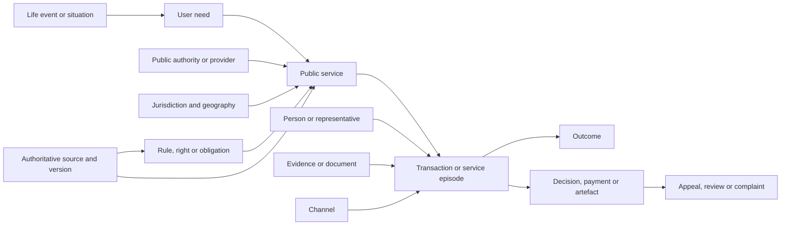

# Generating prompt

> The [Coventry and Warwickshire heritage OKF Explorer](https://chris-page-gov.github.io/okf-explorer/?bundle=https%3A%2F%2Fchris-page-gov.github.io%2Fokf-heritage-coventry-warwickshire%2Fokf-explorer.json#overview) is a great technical example, how about thinking of an educational example - maybe a detailed curriculum with ontology. It would be great if that's available for how Data / Information / Knowledge is researched and studied but I'd also be open to what you find which would be understandable by anyone who would then get the idea of what an ontology was from the everyday example. How about the way Government information is managed from the perspective of a citizen, including stages of life, everything they interact with the state for from emptying the rubbish bins, speeding, parking, shopping, rights, etc.. Think of it as the ultimate user journey from birth to death including nursery provision, education, interacting with the medical and care services, interacting with police and legal services, public transport, private transport requirements (tax, insurance, fuel duty), driving licenses, career and apprenticeships, university and research, applying for jobs, volunteering (including overseas), job seeker support, travel to work, employment (tax, national insurance, progression, health and safety), starting a company, patenting an idea, marriage and civil partnerships, holidays (UK and overseas), support from embassy when overseas, you get the idea but I want it to be meticulous and exhaustive.

# A Life in the UK

This is a stronger educational example than a purely academic curriculum.

**A Life in the UK** is a citizen-centred ontology of public services, rights,
responsibilities and life events—from before birth to death and bereavement.

The important conceptual adjustment is that it should not depict one
implausible person doing everything. It should be a chronological spine
surrounded by branching possible journeys: becoming a parent, moving, becoming
disabled, starting a company, receiving a speeding notice, caring for someone,
emigrating, being a victim or witness, and so on.

# Why it teaches ontology well

Consider a missed rubbish collection:

- **Data:** address, collection date, bin type, scheduled status and reported
  status.
- **Information:** the recycling bin was scheduled for Thursday but was not
  collected.
- **Knowledge:** the household can probably report a missed collection to the
  authority responsible for waste collection, subject to that council's
  reporting window.
- **Ontology:** explains that a household occupies an address; an address falls
  within an authority area; an authority delivers a waste-collection service;
  a schedule governs an expected collection; a missed collection is a service
  failure; and that failure permits a report and potentially a complaint.

A taxonomy merely puts “missed bin collection” below “Recycling and rubbish.”
An ontology explains how the resident, property, council, service, schedule,
failure, evidence, report and outcome relate.

The same pattern scales naturally to parking tickets, school admissions,
passports, benefits, patents and probate.

# The semantic model

The central path should be:

The main concepts would be:

| Concept | Everyday meaning |
|---|---|
| Life stage | Childhood, working age, later life |
| Life event | Birth, moving home, marriage, redundancy, death |
| Situation | Disability, low income, caring, victim of crime |
| User need | “I need to register my child” |
| Service | What government collectively provides to achieve an outcome |
| Transaction | Applying, reporting, paying, appealing or updating |
| Person role | Parent, applicant, carer, driver, tenant, victim, executor |
| Provider | Council, NHS body, police force, court, agency or department |
| Jurisdiction | UK-wide, England, Scotland, Wales, Northern Ireland or local |
| Rule | The legal or policy basis governing the service |
| Relationship to state | Right, entitlement, obligation, prohibition, permission, enforcement or discretionary support |
| Requirement | A condition that must be satisfied |
| Evidence | Certificate, identifier, address proof, medical evidence or form |
| Channel | Online, telephone, post, face-to-face, intermediary or emergency |
| Cost or transfer | Fee, tax, duty, benefit, grant, pension, refund or fine |
| Outcome | Permission, payment, registration, decision, information or support |
| Redress | Reconsideration, appeal, tribunal, complaint or ombudsman |
| Time | Deadline, validity, renewal, review date or statutory period |
| Provenance | Who said it, where it came from and when it was checked |

This aligns unusually well with the EU's
[CPSV-AP 3.2.0](https://semiceu.github.io/CPSV-AP/releases/3.2.0/),
which was specifically designed to describe public services around life and
business events, including evidence, requirements, rules, channels, costs and
outputs.

For locally delivered services, the current UK-government-endorsed standard is
[Open Referral UK](https://www.gov.uk/government/publications/open-standards-for-government/record-and-share-information-about-public-services-in-local-authorities).
It covers services, organisations, locations, eligibility, schedules, costs and
required documents. CPSV-AP and Open Referral UK should therefore be mapped
together rather than inventing everything locally.

SKOS would handle controlled vocabularies and broader/narrower navigation;
OWL/RDFS would define classes and relationships; PROV-O would record
derivation; SHACL would validate publication rules. These roles match the
relevant [W3C SKOS](https://www.w3.org/TR/skos-primer/),
[OWL](https://www.w3.org/TR/2009/REC-owl2-primer-20091027/),
[PROV-O](https://www.w3.org/TR/prov-o/) and
[SHACL](https://www.w3.org/TR/shacl/) standards.

# Life-course coverage

The chronological spine should cover at least these areas:

1. **Before birth and starting a family**
   Fertility and sexual health; pregnancy registration; antenatal and maternity
   care; workplace protections; maternity, paternity and adoption leave;
   financial support; surrogacy, fostering and adoption.

2. **Birth and the newborn period**
   Registering a birth or stillbirth; certificates; naming; parental
   responsibility; nationality and citizenship implications; NHS records;
   Child Benefit; Healthy Start; neonatal care; vaccinations; passports.

3. **Early years**
   Health visitors; childcare eligibility and funding; nursery provision;
   Tax-Free Childcare; childminders; early-years development; disability and
   special educational needs; safeguarding; libraries and children's centres.

4. **School years**
   Admissions; school transport; attendance; home education; free school meals;
   school health; SEND and nation-specific equivalents; exclusions; appeals;
   examinations; children in care; safeguarding and youth services.

5. **Transition to adulthood**
   National Insurance number; first employment; careers advice;
   apprenticeships; qualifications; voting eligibility; provisional driving
   licence; independent healthcare consent; leaving care; transition from
   children's to adult services.

6. **Further education, university and research**
   Courses and qualifications; applications; student finance by nation;
   disabled students' support; accommodation and Council Tax status;
   registering with health services; research funding, ethics and intellectual
   property.

7. **Finding work and unemployment**
   Job search; Jobcentre support; right-to-work evidence; apprenticeships;
   volunteering; DBS checks; Universal Credit and Jobseeker's Allowance; Access
   to Work; redundancy support and retraining.

8. **Employment**
   Contracts; employment status; minimum wage; PAYE; National Insurance;
   workplace pensions; leave; sickness; parental leave; health and safety;
   workplace injury; trade unions; progression; disputes, dismissal and
   employment tribunals. GOV.UK's current overview illustrates the breadth of
   this area in [Working, jobs and pensions](https://www.gov.uk/browse/working).

9. **Housing and community life**
   Renting, owning, moving and homelessness; tenancy deposits; right-to-rent
   differences; Council Tax; electoral registration; planning and building
   regulations; social housing; adaptations; energy support; noise; pests;
   roads; libraries; allotments; parks and community facilities.

10. **Rubbish, recycling and the street**
    Collection schedules; missed bins; recycling containers; garden, bulky,
    hazardous and clinical waste; fly-tipping; litter; dog fouling; abandoned
    vehicles; street cleaning; lighting; potholes and pavements. These are
    represented in the current official
    [Recycling and rubbish](https://www.gov.uk/browse/housing-local-services/recycling-rubbish)
    and [Local councils and services](https://www.gov.uk/browse/housing-local-services/local-councils)
    collections.

11. **Public and private transport**
    Walking and cycling; buses, rail and concessionary travel; community
    transport; taxis; accessibility; Blue Badges; learning to drive; licences;
    buying and registering a vehicle; V5C; tax; SORN; MOT; compulsory
    insurance; fuel duty; parking permits; tolls and clean-air zones;
    collisions.

12. **Transport enforcement**
    Parking notices; private versus council tickets; speeding; notices of
    intended prosecution; identifying the driver; fixed penalties; awareness
    courses; points; disqualification; appeals and courts. The relationship
    between offences, notices, deadlines, points and redress is an excellent
    ontology lesson; see
    [Penalty points, fines and driving bans](https://www.gov.uk/browse/driving/penalty-points-fines-bans).

13. **Money, tax and benefits**
    Income Tax; National Insurance; Self Assessment; VAT encountered through
    purchases; Council Tax; savings and pensions; student loan repayment;
    benefits; grants; debt; insolvency; refunds; tax credits and changes of
    circumstances.

14. **Shopping and consumer rights**
    Goods, services and digital content; contracts; faulty purchases; refunds,
    repair and replacement; scams; credit; Trading Standards; sector
    regulators; ombudsmen and court claims. The official
    [consumer-rights guidance](https://www.gov.uk/consumer-protection-rights)
    already demonstrates jurisdiction-specific advice routes.

15. **Relationships and family change**
    Marriage and civil partnership; changes of name; divorce and dissolution;
    parental responsibility; child maintenance; adoption; domestic abuse;
    family courts; caring responsibilities; powers of attorney and deputyship.

16. **Health throughout life**
    NHS identity and login; GPs; pharmacies; prescriptions; dentists;
    opticians; vaccination; screening; sexual and reproductive health;
    maternity; mental health; referrals; hospitals; rehabilitation; complaints;
    records; health costs; 111 and 999. The
    [NHS services directory](https://www.nhs.uk/nhs-services/) supplies the
    England baseline, with separate national sources required elsewhere.

17. **Disability, care and support**
    Disability benefits; assessments; Access to Work; mobility support;
    social-care needs assessments; carers' assessments; direct payments; home
    adaptations; residential care; safeguarding; mental capacity and
    representation.

18. **Citizenship, democracy and rights**
    Immigration status; settlement; citizenship; passports; voting and
    candidacy; petitions; consultations; contacting representatives; jury
    service; equality rights; data-protection rights; Freedom of Information;
    complaints; honours; charities and volunteering.

19. **Police and legal services**
    Emergencies; reporting crime, fraud, antisocial behaviour, hate crime,
    abuse and missing people; victim and witness support; arrest and legal
    representation; legal aid; criminal, civil and family courts; tribunals;
    jury service; fines; probation; appeals and compensation. GOV.UK separates,
    for example, [reporting crimes](https://www.gov.uk/browse/justice/reporting-crimes)
    from [courts, tribunals and appeals](https://www.gov.uk/browse/justice/courts-sentencing-tribunals);
    the ontology would connect them into actual journeys.

20. **Starting and running an organisation**
    Sole trader, partnership, company, charity and social enterprise;
    Companies House; identity verification; tax; VAT; payroll; licences;
    premises; insurance; health and safety; data protection; procurement;
    grants; exporting; employing people; annual filings; insolvency and
    closure.

21. **Ideas, creativity and research**
    Confidentiality; prior-art searches; patents; copyright; trade marks;
    registered designs; ownership and licensing; grants; university technology
    transfer; publication and commercialisation. The IPO is the responsible
    government body for these rights, and patent search, filing, publication,
    examination and grant must be modelled as distinct stages—not simply
    “patent an idea.” [IPO overview](https://www.gov.uk/government/organisations/intellectual-property-office/about),
    [patent process](https://www.gov.uk/patent-your-invention/request-your-search-and-examination).

22. **Holidays, volunteering and living overseas**
    Passports; entry requirements; country advice; vaccinations; GHIC/EHIC;
    insurance; customs; driving abroad; studying and volunteering; working
    overseas; tax and National Insurance; benefits and pensions; voting from
    abroad; consular assistance; emergency travel documents; arrest,
    hospitalisation, crime and death abroad. The FCDO's
    [support collection](https://www.gov.uk/government/collections/support-for-british-nationals-abroad)
    usefully distinguishes help it may provide from things it cannot do.

23. **Later life**
    State Pension forecast and claim; Pension Credit; workplace pensions;
    concessionary travel; Attendance Allowance; housing adaptations; social
    care; carers; powers of attorney; advance planning; wills; end-of-life and
    palliative care.

24. **Death and bereavement**
    Medical certification or coroner involvement; registering the death; Tell
    Us Once and its Northern Ireland exception; funeral, burial or cremation;
    bereavement benefits; wills; probate, confirmation and jurisdictional
    equivalents; Inheritance Tax; debts; estate administration; property
    records and notifying private organisations. The official
    [death and bereavement](https://www.gov.uk/browse/births-deaths-marriages/death)
    material already exposes an unusually rich chain of dependent services.

Cross-cutting disruptive events—disability, unemployment, homelessness,
domestic abuse, flooding, crime, caring and bereavement—must appear as branches
from every relevant age, rather than being assigned to one stage.

# Educational curriculum

A twelve-part course could run through the same corpus:

| Lesson | Everyday case | What it teaches |
|---|---|---|
| 1 | Bin collection | Data, records and identifiers |
| 2 | “Rubbish”, “refuse” and “recycling” | Terminology and controlled vocabulary |
| 3 | GOV.UK browse categories | Taxonomy and hierarchy |
| 4 | Reporting a missed bin | Classes, properties and instances |
| 5 | Finding the responsible council | Geography, jurisdiction and authority |
| 6 | Applying for a school place | Rules, eligibility and evidence |
| 7 | Learning to drive | End-to-end journeys and dependencies |
| 8 | Receiving a speeding notice | Events, state transitions, deadlines and redress |
| 9 | Moving home | One event triggering many services |
| 10 | Starting a company and protecting an invention | Business events and service composition |
| 11 | Death and Tell Us Once | Data sharing, provenance, exceptions and boundaries |
| 12 | Compare equivalent journeys across four nations | Federation, semantic mapping and incomplete knowledge |

The final exercise should ask learners to answer graph questions such as:

- Which services can be triggered by moving home?
- Which outputs from one service become evidence for another?
- Who is responsible for rubbish collection at a given type of address?
- Which steps in learning to drive involve government, police, courts or
  private compulsory services?
- Where do England, Scotland, Wales and Northern Ireland differ?
- Which decisions can be challenged, through what route, and before what
  deadline?
- Which facts are official, normalized, inferred or merely unknown?

# Important source and governance decisions

There is no single current, authoritative ontology that already provides this
entire UK view. The best design is a carefully governed synthesis:

- Use the [GOV.UK services taxonomy](https://www.gov.uk/browse) as a coverage
  checklist, not as the ontology. GOV.UK explicitly says its topic taxonomy
  describes GOV.UK content and is not intended to model the world or represent
  tasks and user groups.
- Use the [GOV.UK Content API](https://content-api.publishing.service.gov.uk/)
  for source identifiers, links and update metadata.
- Use CPSV-AP for public-service and life-event semantics.
- Use Open Referral UK for local service-directory detail.
- Retain Local Government Services List identifiers where useful, but treat the
  older catalogue as a mapping source rather than proof that a service is
  currently available.
- Model the four nations and local authorities separately. Even England
  contains county, district and unitary arrangements with different
  responsibilities, as the official
  [council-types guidance](https://www.gov.uk/understand-how-your-council-works/types-of-council)
  explains.
- Never publish personal dossiers. Personas and service episodes should be
  synthetic.
- Never turn the bundle into an eligibility, medical or legal decision engine.
  It should explain routes and evidence, then hand users to the current
  authoritative source.
- Distinguish official assertions, normalized mappings, derived relationships
  and editorial examples.

# Recommended OKF product

This should be a separate publication unit—`okf-uk-living`—rather than being
mixed into the AI-infrastructure sample corpus.

A serious first release would contain roughly:

- 12 curriculum lessons;
- 24 life-stage and cross-life maps;
- 40–50 detailed end-to-end journeys;
- 250–400 canonical service-family records;
- explicit jurisdiction, authority, evidence, outcome and redress concepts;
- a governed SKOS/OWL vocabulary and SHACL validation shapes;
- at least 100 competency questions;
- coverage and omission matrices;
- several synthetic personas exercising different nations and circumstances;
- an Explorer overview, chronological timeline, graph, facets and narrative.

The right first three “vertical slices” would be:

1. missed bin collection;
2. learning to drive through a speeding or parking exception;
3. death and bereavement through Tell Us Once, probate and estate
   administration.

Together they exercise local variation, ordinary services, private compulsory
dependencies, enforcement, evidence, deadlines, data sharing, appeals and
multi-agency journeys. Once those work, the remainder can expand
systematically against the declared coverage denominators.
